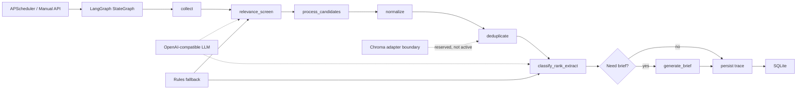

# 产业舆情 Agent PRD

## 1. 产品概述

产业舆情 Agent 面向产业研究员，聚焦新能源汽车和人工智能两个高变化产业。产品目标不是做通用新闻聚合，而是把公开来源中的产业事件自动处理成可追溯、可筛选、可排序、可进入研究报告素材库的情报条目。

核心价值主张：

- 降低信息筛选成本：研究员不再逐个打开政府、交易所、企业官网和行业媒体，而是在一个工作台查看已经过滤、去重和排序的产业情报。
- 提升情报可信度：每条结果保留原文 URL、发布时间、抓取时间、正文证据片段和工作流轨迹，避免只给不可核验的摘要。
- 支持持续监控：系统按数据源配置进行增量采集，首采覆盖最近 24 小时，后续按上次抓取到本次扫描之间的发布时间窗口抓取。
- 输出研究员真正需要的结构化字段：行业细分、事件类型、主体角色、信号属性、重要性、排序原因、关键事实和产业影响。

本 MVP 端到端覆盖“采集 -> 去重 -> 分类打标 -> 排序 -> 核心信息提炼 -> 简报”，其中重点深做三个环节：去重聚类、分类打标、事实提炼。原因是这三者直接决定研究员看到的信息是否可信、是否可解释、是否能复用到后续研究工作。

## 2. 使用场景

### 场景 A：研究员晨间简报

研究员每天上班后打开情报总览，优先查看高价值事件和晨报。系统展示昨晚到今早新增的政策、核心企业动向、技术突破、供应链风险等条目。研究员可按行业、事件类型、重要性筛选，并进入详情页查看关键事实和原文证据。

### 场景 B：突发事件追踪

当政府监管、交易所公告、头部企业发布或行业媒体披露重大风险时，系统在下一轮采集中识别事件，合并同事件多源报道，并把来源权威性、时效性、事件类型和核心主体纳入排序。研究员可快速判断是否需要进一步跟踪。

## 3. 系统架构与数据流

当前运行时使用 LangGraph `StateGraph` 编排 source interval scan，外层图节点为 `collect -> relevance_screen -> process_candidates`。其中 `process_candidates` 内部继续执行 normalize、deduplicate、classify/rank/extract、generate_brief 等业务节点，并将节点输入输出写入 `workflow_runs.node_trace_json`。



## 4. 核心功能与技术方案

### 4.1 采集标准化

系统内置 24 个公开来源，覆盖政府/监管、交易所、企业官网和行业媒体。每个来源配置 `fetch_interval_minutes`、`reliability_score`、`industry_hint` 和启用状态。

采集策略按数据源增量执行：首次采集默认读取最近 24 小时内发布的文章；后续采集使用 `sources.last_fetched_at` 到本次扫描时间作为发布时间窗口。采集器从 RSS/XML 或 HTML 列表页提取候选链接，并深入文章页抓取标题、正文和发布时间。无法取得发布时间的候选不会穿透时间窗口，以降低旧文重复进入的概率。

标准化阶段写入 `raw_items`：保留 `url`、`canonical_url`、`title`、`author`、`published_at`、`fetched_at`、`raw_content`、`content_excerpt`、`content_hash` 和相关性字段。`content_excerpt` 是展示和兜底摘要，不等同于最终情报摘要。

### 4.2 去重聚类

同一事件可能被政府、企业和媒体多次报道。系统不删除原始报道，而是保留每条 `raw_items`，并在 `event_clusters` 中建立事件聚类。聚类依据包括规范化 URL、规范化标题、正文 hash、规则 key 和近似标题。代表项选择优先权威来源、正文完整度和发布时间，详情页仍可追溯相似报道。

当前 Chroma 作为向量能力的预留边界，MVP 不声称已经启用语义向量去重。后续可在聚类候选召回中引入 Chroma embedding，以提升跨标题、跨语言和改写报道的同事件识别能力。

### 4.3 分类打标

分类节点围绕固定 taxonomy 输出结构化标签：行业、行业细分、事件类型、主体角色、信号属性、重要性等级、关键主体等级、实体和置信度。LLM 可用时只接收原文、来源元数据、枚举定义和判断规则，不接收本地规则的候选结果，避免模型被规则先验干扰。LLM 输出必须通过枚举校验；字段缺失、越界或证据不足时回退本地规则。

### 4.4 排序评分

排序不由 LLM 直接给总分，而是使用显式加权公式：

```text
rank_score =
  importance_score * 0.35
+ source_score * 0.20
+ freshness_score * 0.15
+ event_type_score * 0.15
+ coverage_score * 0.10
+ key_actor_score * 0.05
```

该设计保证排序可解释、可复现、可调参。`score_breakdown_json` 保存每个子项得分和理由，前端详情页展示排序依据。

### 4.5 核心信息提炼

事实提炼节点输出 `summary`、`key_facts_json`、`impact_analysis` 和 `source_spans_json`。LLM 可用时，提示词要求所有主体、时间、地点、金额、产品、因果和影响必须回到原文证据；失败时回退规则提炼。`key_facts` 覆盖 who、what、when、where、why、impact、evidence，适合直接进入研究员素材库。

### 4.6 简报与前端呈现

系统支持晨报和手动简报，默认晨间任务在采集后生成简报。前端工作台展示情报列表、筛选排序、详情、原文链接、标签体系、评分规则、采集运行和数据源状态。

## 5. 标签体系设计

标签体系详见 [TAG_TAXONOMY.md](标签设计说明)。核心思想是围绕“研究员写产业报告时需要什么信号”设计，而不是采用通用新闻分类。

主要维度：

- 行业：新能源汽车、人工智能。
- 行业细分：每个行业 8 个细分方向，覆盖产业链关键环节。
- 事件类型：政策/监管、融资/投资、并购/重组、产品发布、技术突破、战略合作、产能/交付、价格/商业化、龙头企业动向、供应链变化、海外扩张、风险/负面舆情。
- 主体角色：政府/监管、整车厂/模型厂商、核心零部件/芯片企业、电池/算力基础设施企业、投资机构等。
- 信号属性：机会、风险、政策、竞争格局、技术路线、商业化、区域产业、资本市场。
- 重要性：high、medium、low，并通过来源、事件类型、核心主体和影响范围解释。

## 6. 数据存储与选型

MVP 使用 SQLite，原因是交付周期短、部署简单、可持久化、易于本地演示和检查。后续生产环境可迁移到 PostgreSQL，并将 Chroma 接入语义召回。

主要表：

- `sources`：数据源配置、可靠性、抓取间隔和源级运行状态。
- `raw_items`：原始文章级记录，保留正文、发布时间、抓取时间、hash 和相关性判断。
- `event_clusters`：同事件聚类和代表项。
- `processed_items`：分类、摘要、关键事实、影响分析、排序分、模型元数据。
- `item_tags`：多维标签明细，支持筛选和统计。
- `briefs`：晨报和手动简报。
- `workflow_runs`：工作流运行状态、计数、错误和节点轨迹。

索引围绕高频查询设计，包括发布时间、正文 hash、事件聚类、重要性、排序分、标签维度和值、运行时间。

## 7. 非功能需求

- 采集频率：政府/监管、交易所和企业官网默认 60 分钟；行业媒体默认 120 分钟；高价值源可缩短间隔。
- 时延目标：单轮采集处理在本地演示环境下分钟级完成；晨报在每日 08:30 前生成。
- 可追溯性：每条处理结果必须能回到原始 URL、原文正文、发布时间、抓取时间和节点轨迹。
- 准确性目标：分类结果必须满足枚举约束；LLM 输出必须通过结构化校验；排序公式可解释。
- 降级能力：数据源失败记录 `last_error`；LLM 未配置或调用失败时使用规则兜底；工作流失败写入 `workflow_runs`。

## 8. 风险与依赖

- 公开网页结构变化会影响采集稳定性，需要持续维护列表页和正文解析规则。
- 部分来源缺少发布时间，增量窗口可能无法覆盖，需要优先接入 RSS、站点地图或官方 API。
- LLM 分类和提炼需要严格结构化约束，否则存在幻觉风险；当前通过提示词、枚举校验和规则回退降低风险。
- SQLite 适合本地演示和轻量部署，生产环境需要更强并发、备份和监控能力。
- Chroma 目前是预留能力，若要实现语义去重和相似事件召回，需要补齐 embedding 生成、向量索引和评估集。

## 9. 后续路线

1 个月内优先完善真实采集稳定性、相关性评估集、同事件聚类评估和人工反馈入口。3 个月内推进 Chroma 语义召回、专题订阅、企业 IM 推送、多语言来源、标注回流和质量评估闭环。
