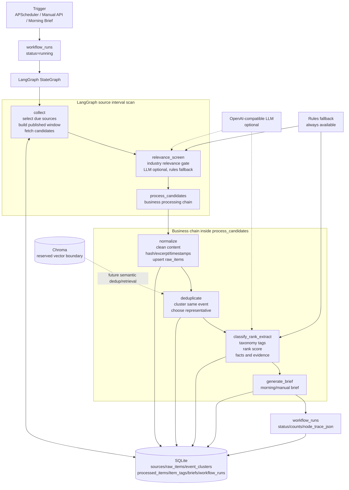

# 工作流编排示意图

本文档说明产业舆情 Agent 的运行时编排边界。当前实现已经使用 LangGraph `StateGraph` 作为 source interval scan 的主编排框架；业务处理子链路在 `process_candidates` 节点内继续展开，并通过 `workflow_runs.node_trace_json` 记录完整轨迹。

## 总览

## 节点逻辑

### collect

- 选择目标数据源：手动全量触发时读取所有启用来源；定时扫描时读取到期来源。
- 计算源级发布时间窗口：首次采集默认最近 24 小时；后续使用 `last_fetched_at` 到本次扫描时间。
- 调用采集器读取 RSS/XML 或 HTML 列表页，并深入文章页抽取标题、正文和发布时间。
- 更新 `sources.last_checked_at`、`sources.last_fetched_at`、`sources.last_error`。
- 在 trace 中记录目标来源、窗口、候选数量和采样候选。

### relevance_screen

- 判断候选是否属于新能源汽车或人工智能产业情报。
- LLM 配置可用时使用结构化 JSON 判断；不可用、失败或输出不合法时回退规则。
- 过滤泛社会新闻、内部会议、栏目模板、导航页、低信息正文和只有弱关键词的候选。
- 输出 accepted/rejected 候选，并记录判断理由、置信度、命中词和 provider/model。

### normalize

- 清洗正文中的 HTML、脚本、CSS、站点模板、导航和广告噪声。
- 生成 `content_excerpt`、`content_hash`、`fetched_at` 等标准字段。
- 按 URL 幂等写入或更新 `raw_items`，保留原文 URL 和相关性判断。

### deduplicate

- 读取本轮 `raw_items`，按 URL、标题规范化、内容 hash 和规则 key 聚类。
- 同事件多源报道不删除，只挂到同一个 `event_clusters`。
- 代表项优先选择权威来源、正文更完整、发布时间更新的条目。

### classify_rank_extract

- 对代表项或聚类内待处理条目执行分类、排序和事实提炼。
- 分类输出固定 taxonomy 标签，并写入 `item_tags`。
- 排序使用显式加权公式，结果写入 `processed_items.rank_score` 和 `score_breakdown_json`。
- 提炼输出摘要、关键事实、产业影响、证据片段和 LLM/兜底模式元数据。

### generate_brief

- 当触发类型为 `scheduled_morning` 或 `manual_brief` 时生成简报。
- 按时间窗口和排序分选取高价值情报，输出 Markdown 简报并写入 `briefs`。

## 可观测性

每次运行都会写入 `workflow_runs`：

- `trigger_type`：手动、定时、晨报等触发类型。
- `status`：running、success、failed、skipped。
- `collected_count`、`deduped_count`、`classified_count`、`extracted_count`、`failed_count`。
- `error_summary`：失败原因。
- `node_trace_json`：各节点输入输出摘要，便于答辩和问题定位。

## 当前边界说明

- LangGraph 已用于运行时主编排。
- LangChain-core 作为依赖边界保留，当前业务代码主要直接使用 LangGraph 和 OpenAI-compatible HTTP LLM client。
- Chroma 已列入依赖和架构预留，但当前没有启用向量索引、embedding 或语义去重；文档和演示不应声称已完成该能力。
