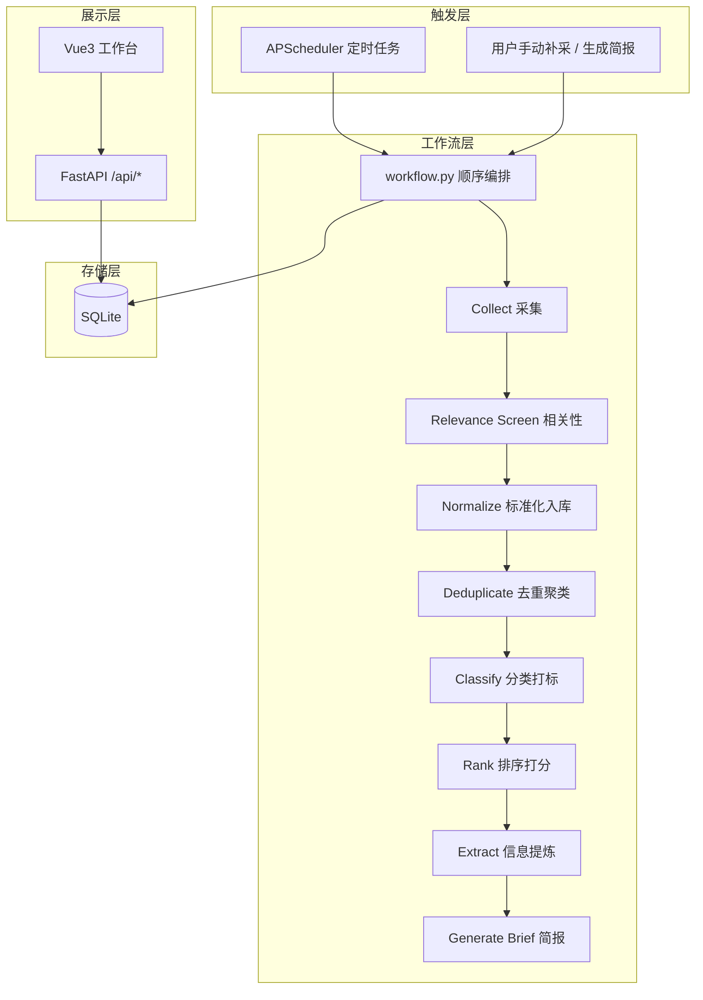
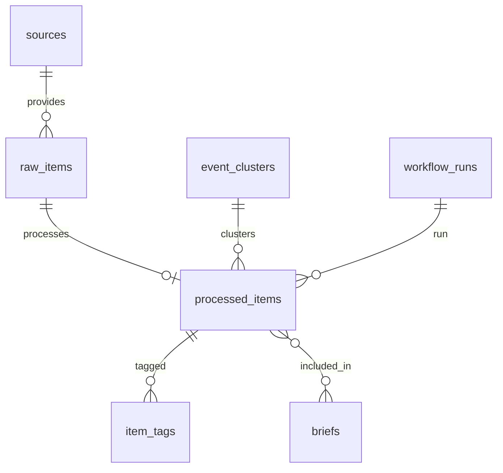

# 产业舆情 Agent V2 — 项目实施说明

> 本文档对照课题《产业舆情Agent.md》，说明本项目的实现方式、工作流编排、各节点逻辑、数据库设计与前后端交互，并给出符合性评估。

---

## 1. 项目概述

### 1.1 产品定位

面向**产业研究员**（主用户，60%）的产业情报工作台，聚焦 **新能源汽车** 与 **人工智能** 两个产业。系统持续监控公开信息源，自动完成：

**采集 → 相关性筛选 → 标准化入库 → 去重聚类 → 分类打标 → 排序 → 核心信息提炼 → 简报生成**

用户打开 Web 工作台即可查看过滤过、排过序、精炼过的产业舆情情报，并可追溯原文、查看处理依据。

### 1.2 MVP 深做策略（课题 4.1 要求）

课题要求在一周内从 5 个环节中**任选 2–3 个做深**。本项目选择：

| 环节 | 深度 | 说明 |
|------|------|------|
| **去重** | 深做 | 规则聚类 + 事件簇 + 多源代表项选择 + 前端相似报道展示 |
| **分类打标** | 深做 | 六维标签体系 + 固定枚举校验 + 规则/LLM 双路径 + 证据留存 |
| **核心信息提炼** | 深做 | 5W1H 关键事实 + 证据片段 + LLM/规则降级 |
| 数据采集 | 基础可用 | 24 个真实公开源 HTTP 抓取，定时/手动触发 |
| 排序 | 基础可用 | 显式加权公式，分项可解释，不让 LLM 直接打分 |

### 1.3 用户故事落地

> 研究员小张每天上班第一件事，想知道「昨晚到今早，我关注的新能源汽车产业有什么新动静？」

系统通过 **每日 08:20 全量补采 + 08:30 晨报生成**，以及 **工作日每 2 小时增量监控**，让小张打开「情报总览」即可看到按综合价值分排序的结构化情报，无需逐个打开新闻 App。

---

## 2. 课题符合性检查

### 2.1 核心需求对照表

| 课题要求 | 实现状态 | 实现位置 / 说明 |
|----------|----------|-----------------|
| 5 个工作流环节完整链路 | ✅ 已实现 | `backend/app/services/workflow.py` |
| 至少 5–6 个数据源 | ✅ 超额完成 | `seed_data.py` 配置 **24** 个公开源 |
| 定时或按需触发采集 | ✅ 已实现 | `scheduler.py` + `POST /api/collect/manual` |
| 去重（URL/标题/规则聚类） | ✅ 已实现 | URL 唯一 + `_cluster_key()` 规则聚类 |
| 多维度分类打标 | ✅ 已实现 | 6 维标签，见 `taxonomy.py` |
| 按业务价值排序 | ✅ 已实现 | `ranking.py` 加权公式 |
| 摘要 + 关键事实提炼 | ✅ 已实现 | `extractor.py` |
| 原文可追溯 | ✅ 已实现 | `raw_items.url` + `source_spans` |
| 标签判断可解释 | ✅ 已实现 | `item_tags.evidence_json` + 分类依据 |
| 前端列表/筛选/排序/详情 | ✅ 已实现 | `frontend/src/App.vue` |
| Agent/工作流编排 | ✅ 已实现 | `workflow_graph.py` 使用 LangGraph `StateGraph` 编排 source interval scan |
| LLM 调用 | ✅ 已实现 | `llm.py`，可选，无 Key 时规则兜底 |
| 数据持久化落库 | ✅ 已实现 | SQLite WAL，`database.py` |
| PRD / README / 架构图 | ✅ 已有 | `docs/` + `README.md` + `ARCHITECTURE.md` |

### 2.2 加分项对照

| 加分项 | 状态 | 说明 |
|--------|------|------|
| 实体抽取 | ⚠️ 基础版 | 分类节点输出 `entities_json`，无独立 NER 管线 |
| 关系抽取 | ❌ 未实现 | 设计文档预留，代码未落地 |
| 简报推送 | ⚠️ 部分 | 定时晨报 + 手动简报，无邮件/IM 推送 |
| 工作流可观测 | ✅ 已实现 | `workflow_runs.node_trace_json` + 前端「采集运行」页 |
| 质量自评估 | ⚠️ 部分 | 79 个单元测试覆盖契约，无线上抽样评估 |
| 异常处理与降级 | ✅ 已实现 | 源失败记录、LLM 失败回退规则、并发跳过 |
| 容器化部署 | ✅ 已实现 | `docker-compose.yml` |
| 语义级去重 / Chroma | ❌ 未实现 | `vector_store.py` 为空桩，依赖已安装未使用 |
| 社交媒体源 | ❌ 未接入 | 源类型为政府/交易所/企业/媒体，无微博/公众号 |

### 2.3 总体评估

**满足课题 MVP 与答辩演示要求。** 五个环节端到端可跑通，标签体系、去重、提炼三个深做环节有可评估的输出；24 数据源、SQLite 持久化、前端工作台、工作流 Trace 均到位。

**主要差距：** Chroma 仍停留在适配器边界；去重为规则级而非语义级；无关系抽取与外部推送渠道。这些在 `docs/superpowers/specs/2026-05-30-industrial-opinion-agent-design.md` 中有规划，但本周 MVP 以可演示、可解释为优先。

---

## 3. 技术框架

### 3.1 技术栈总览

```
┌─────────────────────────────────────────────────────────────┐
│  前端：Vue 3.5 + Vite 6（单页 App.vue，无路由库）              │
├─────────────────────────────────────────────────────────────┤
│  后端：FastAPI 0.115 + Uvicorn                               │
│  调度：APScheduler 3.10（BackgroundScheduler）               │
│  存储：SQLite（WAL 模式，默认 backend/data/opinion_agent.sqlite3）│
│  LLM：OpenAI-compatible HTTP（urllib 直调 /chat/completions） │
├─────────────────────────────────────────────────────────────┤
│  工作流：LangGraph 0.2 compiled graph（source interval scan）    │
│  设计边界（依赖已装，运行未用）：ChromaDB 0.5                   │
└─────────────────────────────────────────────────────────────┘
```

### 3.2 目录结构

| 路径 | 职责 |
|------|------|
| `backend/app/main.py` | FastAPI 应用入口、CORS、启动时 seed + scheduler |
| `backend/app/api.py` | REST API 路由 |
| `backend/app/database.py` | Schema 定义与 Database 封装 |
| `backend/app/scheduler.py` | 定时任务注册 |
| `backend/app/seed_data.py` | 24 数据源配置 + 测试用 demo 样例 |
| `backend/app/services/workflow.py` | **工作流主编排** |
| `backend/app/services/*.py` | 各处理节点服务 |
| `frontend/src/App.vue` | 全部 UI（情报总览/简报/运行/源/标签/评分） |
| `docs/ARCHITECTURE.md` | 架构与数据来源 |
| `docs/superpowers/specs/` | 完整 PRD 级设计文档 |

### 3.3 环境配置

见 `backend/.env.example`：

| 变量 | 默认值 | 作用 |
|------|--------|------|
| `DATABASE_PATH` | `data/opinion_agent.sqlite3` | 数据库路径 |
| `SCHEDULER_ENABLED` | `1` | 是否启动定时任务 |
| `SEED_ON_START` | `1` | 启动时写入 24 源配置 |
| `LLM_API_KEY` | 空 | 空则全链路规则兜底 |
| `LLM_BASE_URL` | OpenAI 兼容端点 | 可接 DashScope 等 |
| `APP_TIMEZONE` | `Asia/Shanghai` | 调度时区 |

---

## 4. 系统架构与数据流

### 4.1 逻辑架构图



### 4.2 数据分层

| 层级 | 表 | 含义 |
|------|-----|------|
| 配置层 | `sources` | 数据源元信息与抓取状态 |
| 原始层 | `raw_items` | 单篇原文（URL 唯一），保留 `raw_content` |
| 事件层 | `event_clusters` | 同一事件的多源报道簇 |
| 处理层 | `processed_items` + `item_tags` | 摘要、事实、分数、多维标签 |
| 输出层 | `briefs` | Markdown 晨报/筛选简报 |
| 运维层 | `workflow_runs` | 每次运行的计数与节点 Trace |

**原始数据与处理后数据分离：** `raw_items` 只存原文；`processed_items` 通过 `raw_item_id` 一对一关联，分类/排序/提炼结果不覆盖原文。

---

## 5. 工作流编排

### 5.1 入口函数

| 函数 | 场景 |
|------|------|
| `run_source_interval_scan()` | **生产主路径**：按到期源或 `force_all` 采集并处理 |
| `run_workflow(seed_demo_items=True)` | **测试路径**：用 `demo_raw_items()` 跑下游管道 |
| `generate_brief()` | 晨报任务单独调用（08:30） |

### 5.2 并发与恢复

- **并发保护：** 若存在 `status=running` 的 `workflow_runs`，新任务记为 `skipped`，避免重复采集。
- **进程恢复：** 启动时 `recover_interrupted_runs()` 将遗留 `running` 标为 `failed`。
- **Trace 记录：** 每个节点写入 `node_trace_json`，含 `input` / `output` 载荷。

### 5.3 节点执行顺序

```text
collect
  → relevance_screen
  → normalize
  → deduplicate
  → classify_rank_extract（分类 + 排序 + 提炼合并为一个 trace 节点）
  → generate_brief（仅 scheduled_morning / manual_brief 触发）
  → persist（更新 workflow_runs 统计）
```

### 5.4 定时任务（`scheduler.py`）

| Job ID | 触发规则 | trigger_type | 行为 |
|--------|----------|--------------|------|
| `source_interval_scan` | 每 10 分钟 | `source_interval_scan` | 仅抓取 `due_sources()` |
| `scheduled_monitor_every_2h` | 工作日 9/11/13/15/17:00 | `scheduled_monitor` | `force_all=True` 全源扫描 |
| `high_authority_hourly` | 工作日 9–18:30 | `high_authority_monitor` | 高权威源增量 |
| `scheduled_morning_collect` | 每天 08:20 | `scheduled_morning` | 全源补采 + 处理 + 简报 |
| `scheduled_morning_brief` | 每天 08:30 | — | 仅 `generate_brief(morning)` |

`due_sources()` 根据 `fetch_interval_minutes`（多数源 60–120 分钟）与 `last_fetched_at` 判断是否到期。

---

## 6. 各节点处理逻辑

### 6.1 Collect — 数据采集

**文件：** `backend/app/services/collector.py`

**输入：** `sources` 表中启用且到期的数据源配置。

**处理逻辑：**

1. HTTP GET 抓取列表页（RSS/XML 或 HTML）。
2. 解析候选文章：链接、标题、发布时间、正文片段。
3. 正文清洗：剥离 script/style、统计脚本、CSS 噪声、导航文案等（大量正则规则）。
4. 单篇详情页二次抓取（若列表页正文不足）。
5. 输出候选列表 `{source_id, url, title, raw_content, published_at, ...}`。

**输出与副作用：**

- 成功：更新 `sources.last_fetched_at`，清除 `last_error`。
- 失败：写入 `sources.last_error`，`failed_count++`，不伪造数据。
- Trace：`source_results` 记录每源状态与候选数。

**数据源（24 个）：**

| 类型 | 数量 | 示例 |
|------|------|------|
| 政府/监管 | 7 | 工信部、发改委、科技部、中国政府网政策库 |
| 交易所/公告 | 3 | 上交所、深交所、港交所披露易 |
| 企业官网 | 10 | 比亚迪、宁德时代、英伟达、OpenAI 等 |
| 行业媒体 | 4 | 机器之心、量子位、盖世汽车、第一电动网 |

### 6.2 Relevance Screen — 产业相关性筛选

**文件：** `backend/app/services/relevance.py`

**目的：** 在入库前过滤与 NEV/AI 无关的低信息页面（政府网站首页、内部党建新闻等）。

**双路径：**

1. **规则路径（默认）：** 匹配 `NEV_TERMS` / `AI_TERMS` 关键词；拒绝 `INTERNAL_OR_GENERAL_NEGATIVE_TERMS`；低信息页（正文过短、标题泛化）直接拒绝。
2. **LLM 路径（配置 Key 后）：** JSON 输出 `is_relevant / industry / reason / matched_terms`，失败则回退规则。

**输出：** 接受项附带 `relevance_*` 字段；拒绝项仅进入 Trace，**不写入 `raw_items`**。

### 6.3 Normalize — 标准化入库

**文件：** `workflow.py` + `collector.normalize_raw_item()`

**处理逻辑：**

1. 合并源类型、产业 hint、相关性元数据。
2. 计算 `content_hash`、`content_excerpt`（展示用摘要，非切片存储）。
3. **URL 去重：** 已存在则 UPDATE 相关性字段；否则 INSERT `raw_items`。

**字段要点：**

- `raw_content`：保留完整清洗后正文（可追溯）。
- `status`：`new` → 处理后变 `processed`。

### 6.4 Deduplicate — 去重与事件聚类

**文件：** `workflow.py` + `dedup.py`

**策略（MVP 规则级，非语义 embedding）：**

1. **URL 级：** `raw_items.url` UNIQUE，同一链接不重复入库。
2. **标题规范化：** `normalize_title()` 去空白、标点、大小写。
3. **事件聚类键 `_cluster_key()`：**
   - 领域规则：如「电池+政策」→ `battery-policy`，「英伟达/AI芯片」→ `nvidia-ai-chip` 等。
   - 默认：规范化标题前 28 字符。
4. **事件簇 `event_clusters`：** `similarity_reason = rule:{key}`，累计 `duplicate_count`。
5. **代表项选择 `choose_representative_item()`：**
   - 优先级：来源权威性 > 正文长度 > 发布时间。

**同事件多源策略：** 各源报道**均保留**为独立 `raw_items`，仅通过 `canonical_event_id` 归入同一簇；前端列表展示代表项，详情页展示「相似报道」。

### 6.5 Classify — 分类打标

**文件：** `backend/app/services/classifier.py` + `taxonomy.py`

**标签维度（课题 4.3）：**

| 维度 | 示例值 | 设计意图 |
|------|--------|----------|
| `industry` | 新能源汽车、人工智能 | 产业主线 |
| `industry_subtag` | 动力电池、AI 芯片、智能体/Agent… | 研究员细分赛道 |
| `event_type` | 政策/监管、融资/投资、技术突破… | **产业信号类型**（非通用新闻分类） |
| `importance_level` | high / medium / low | 研究员优先级 |
| `subject_role` | 整车厂、政府/监管机构、投资机构… | 涉及主体 |
| `signal_attribute` | 机会信号、风险信号、政策信号… | 对报告撰写的语义 |

**处理流程：**

1. 规则引擎：关键词 + 来源类型 + 关键主体（`KEY_ACTORS`）→ 初始标签。
2. LLM 增强（可选）：结构化 JSON 覆盖子标签/事件类型/重要性，**必须通过 `_validate_result()` 枚举校验**，非法标签抛 `ClassificationError` 并回退规则。
3. 写入 `item_tags` 表，每条标签带 `evidence_json`（命中关键词、来源类型等）。

**重要性判断示例：**

- 政府源 + 政策类关键词 → `high`
- 核心企业（比亚迪、英伟达、工信部等）动向 → 提升 `key_actor_level`
- 一般媒体转载 → `medium` / `low`

### 6.6 Rank — 业务价值排序

**文件：** `backend/app/services/ranking.py`

**公式（不让 LLM 输出总分）：**

```text
rank_score =
  importance_score  × 0.35
+ source_score      × 0.20
+ freshness_score   × 0.15
+ event_type_score  × 0.15
+ coverage_score    × 0.10
+ key_actor_score   × 0.05
```

| 子项 | 计算方式 |
|------|----------|
| `importance_score` | high=1.0, medium=0.6, low=0.25，× 置信度修正 |
| `source_score` | `sources.reliability_score`（政府 1.0，媒体 0.75…） |
| `freshness_score` | 6h/24h/72h/168h 分档衰减 |
| `event_type_score` | 政策/监管最高 1.0，产品发布 0.5 等 |
| `coverage_score` | 事件簇内可靠源数量 `log2` 归一化 |
| `key_actor_score` | core/important/normal/none 映射 |

结果写入 `processed_items.rank_score` 与 `score_breakdown_json`，前端详情页以进度条展示分项。

### 6.7 Extract — 核心信息提炼

**文件：** `backend/app/services/extractor.py`

**输出结构：**

```json
{
  "summary": "基于原文的产业情报摘要",
  "key_facts": {
    "who": "主体",
    "what": "事件",
    "when": "时间",
    "where": "地点/范围",
    "why": "原因/背景",
    "impact": "产业影响",
    "evidence": "原文证据片段"
  },
  "impact_analysis": "影响分析句",
  "source_spans": [
    {"field": "raw_content", "start": 0, "end": 120, "quote": "..."}
  ]
}
```

**双路径：**

1. **LLM（配置后）：** JSON mode，Prompt 明确要求不得编造、`source_spans` 必须对应 `raw_content/content_excerpt/title` 真实子串；校验失败则降级。
2. **规则兜底：** `build_summary()` + `extract_key_facts()`，证据取正文前 180 字。

**防幻觉措施：**

- `_validate_source_spans()` 校验 quote 在原文字段中确实存在。
- `_validate_key_facts()` 确保必填字段非空。
- `extraction_mode` 字段标记 `llm` 或 `rules_fallback`，便于审计。

### 6.8 Generate Brief — 简报生成

**文件：** `backend/app/services/briefs.py`

- 按 `rank_score DESC` 取 Top 8 条 `processed_items`。
- 生成 Markdown：标题、综合分、来源、结论、原文链接。
- 写入 `briefs` 表；类型 `morning`（晨报）或 `manual`（筛选简报）。

---

## 7. 标签体系设计说明（课题核心评分项）

### 7.1 设计出发点

标签不是通用「财经/科技/社会」新闻分类，而是围绕**研究员写产业报告时需要捕捉的信号**：

- 「地方政府出台 AI 产业园政策」→ `政策/监管` + `政策信号` + `区域产业变化`，权重高于一般产品发布。
- 「龙头企业产能/交付进展」→ `龙头企业动向` + `产能/交付`，影响供应链与竞争格局章节。
- 「监管风险/负面舆情」→ 高 `event_type_score`，服务政府次用户的及时性诉求。

### 7.2 与三类用户的映射

| 用户 | 主要使用的标签维度 |
|------|-------------------|
| 产业研究员 | 全行业 + `event_type` + `signal_attribute` + `importance` |
| 政府部门 | `政策/监管`、`风险/负面舆情`、`区域产业变化`、政府来源筛选 |
| 企业战略部 | `龙头企业动向`、`供应链变化`、`海外扩张`、`竞争格局变化` |

### 7.3 事件类型权重（体现价值差异）

政策/监管 (1.0) > 风险舆情 (0.95) > 龙头动向 (0.9) > 技术突破 (0.85) > … > 产品发布 (0.5)

融资 vs 产品发布：融资影响资本市场与竞争格局章节（0.75），产品发布偏单点信息（0.5），排序公式中通过 `event_type_score` 体现差异。

---

## 8. 数据库设计

### 8.1 Schema 概览（`database.py`）

```sql
sources          -- 数据源配置与健康度
raw_items        -- 原始资讯（url UNIQUE）
event_clusters   -- 事件簇
processed_items  -- 处理结果（raw_item_id UNIQUE）
item_tags        -- 多维标签
briefs           -- 简报
workflow_runs    -- 运行日志与 Trace
```

### 8.2 选型理由

| 决策 | 理由 |
|------|------|
| SQLite | 一周 MVP、单机部署、零运维；WAL 模式支持并发读；答辩演示足够 |
| 关系型表 + JSON 列 | 标签、分数分项、关键事实结构多变，JSON 避免宽表爆炸 |
| 未用 MongoDB | 情报条目关系明确（源→原文→处理→标签），JOIN 查询简单 |
| 未用 Redis | 无高频缓存需求；调度状态落 `workflow_runs` |
| Chroma 预留 | 语义去重为 1 个月路线，MVP 用规则聚类 |

### 8.3 索引策略

```sql
idx_raw_items_content_hash      -- 内容去重辅助
idx_raw_items_published_at      -- 时间筛选
idx_processed_items_rank        -- 列表默认按分排序
idx_processed_items_importance    -- 高价值筛选
idx_item_tags_dimension_value     -- 标签筛选
idx_workflow_runs_started         -- 运行记录
```

### 8.4 ER 关系简图



---

## 9. API 与前后端交互

### 9.1 API 列表

| 方法 | 路径 | 功能 |
|------|------|------|
| GET | `/api/intelligence/summary` | 总览统计、最近监控、晨报状态 |
| GET | `/api/intelligence/items` | 情报列表（多维筛选 + sort=rank/time） |
| GET | `/api/intelligence/items/{id}` | 详情 + 相似报道 + 6 步处理轨迹 |
| GET | `/api/events/{cluster_id}` | 事件簇详情 |
| GET | `/api/briefs` | 简报列表 |
| POST | `/api/briefs/generate` | 手动生成筛选简报 |
| GET | `/api/runs` | 工作流运行记录（含 node_trace） |
| POST | `/api/collect/manual` | 手动全量补采 |
| GET | `/api/sources` | 数据源配置与健康 |
| GET | `/api/taxonomy` | 标签枚举（驱动前端筛选器） |
| GET | `/api/ranking-rules` | 评分公式说明 |
| GET | `/api/llm/status` | LLM 配置状态（不暴露 Key） |

OpenAPI：`http://localhost:8000/docs`

### 9.2 前端页面与交互（`App.vue`）

| 页面 | 功能 | 关键交互 |
|------|------|----------|
| **情报总览**（默认） | 三栏工作台 | 左：多维筛选；中：情报流（>5 条自动巡航）；右：详情 |
| **简报中心** | Markdown 晨报/简报 | 只读展示 |
| **采集运行** | `workflow_runs` 列表 | 展开节点 Trace JSON |
| **数据源配置** | 24 源卡片 | 展示 reliability、last_error |
| **标签体系** | 枚举只读 | 答辩解释用 |
| **评分规则** | 公式与权重 | 答辩解释用 |

**情报总览交互细节：**

- 筛选变更自动 `loadItems()`；支持 keyword、时间窗（24h–all）、行业/子标签/事件类型/重要性/主体/信号/来源类型、条数、排序。
- 顶栏「手动补采」→ `POST /api/collect/manual`；「生成筛选简报」→ `POST /api/briefs/generate`。
- 详情页：原文外链、`key_facts` 五要素、评分分项进度条、相似报道列表、`item_processing_trace` 六步轨迹。
- LLM 状态卡：显示 provider/model 或「规则兜底」。

**开发代理：** Vite 将 `/api`、`/health` 代理到 `localhost:8000`。

---

## 10. 可信度与溯源机制（课题 4.2）

| 要求 | 实现 |
|------|------|
| 追溯到原始 URL | `raw_items.url`，前端「打开原文链接」 |
| 抓取时间 | `raw_items.fetched_at` |
| 原文片段 | `raw_content` / `content_excerpt` / `source_spans.quote` |
| 摘要不编造 | LLM Prompt 约束 + span 校验 + 规则兜底只用原文 |
| 标签可解释 | `item_tags.evidence_json`、分类 `importance_reason` |
| 处理可审计 | `item_processing_trace` 串联 collect→…→extract 六步 |

---

## 11. 异常处理与降级

| 场景 | 行为 |
|------|------|
| 数据源 HTTP 失败 | 记录 `sources.last_error`，跳过该源，不中断整次运行 |
| 源返回空列表 | 记 `empty` 状态，`failed_count++` |
| 并发工作流 | 新任务 `skipped`，Trace 记录原因 |
| 进程重启 | `recover_interrupted_runs()` 关闭悬挂 run |
| LLM 未配置 | relevance/classify/extract 全走规则 |
| LLM 调用失败/非法 JSON | 单节点 fallback，标记 `extraction_mode=rules_fallback` |
| 非法分类标签 | `ClassificationError` → 保留规则结果 |

---

## 12. 测试与工程质量

### 12.1 后端测试（`tests/test_core_behavior.py`）

设计覆盖 79 个用例，主要测试类：

- `ClassificationContractTest` — 标签枚举、LLM 结构化输出
- `RankingFormulaTest` — 加权公式边界
- `RelevanceScreenContractTest` — 相关性规则与 LLM
- `WorkflowTraceContractTest` — 节点 Trace 完整性
- `RealSourceCollectionContractTest` — 真实采集路径
- `IntelligenceApiContractTest` — API 筛选与详情
- `SourceConfigContractTest` — 24 源契约

运行：`cd backend && python -m unittest discover -s tests -v`（需先 `pip install -r requirements.txt`）

### 12.2 前端契约测试

`frontend/tests/` 下 Node 脚本验证：自动巡航状态机、时间显示、LLM 状态 UI、Trace UI 布局等。

---

## 13. 部署

### 13.1 本地启动

```powershell
# 后端
cd backend
python -m venv .venv
.\.venv\Scripts\Activate.ps1
pip install -r requirements.txt
python -m app.main

# 前端
cd frontend
npm install
npm run dev
```

- 前端：http://localhost:5173  
- API：http://localhost:8000  

### 13.2 Docker

```powershell
docker compose up --build
```

数据卷 `./data` 持久化 SQLite。

---

## 14. 课题 PRD 核心问题摘要（5.1–5.4）

### 14.1 研究员关注的事件维度

最关心：**政策/监管变化、龙头企业与供应链动向、技术路线与商业化节点、风险与负面信号、融资/并购等资本事件**。标签体系按「写报告章节需要什么素材」设计，而非情感分析或通用体裁分类。

### 14.2 核心使用场景

1. **早晨看简报：** 08:30 打开工作台或「简报中心」，阅读昨夜至今 Top 情报。  
2. **白天持续监控：** 每 2 小时自动更新，列表按 `rank_score` 排序。  
3. **临时深挖：** 筛选某子赛道（如「动力电池」）+ 查看详情相似报道与处理轨迹。

产品形态：**Web 工作台**（MVP）；邮件/IM/API 为 1–3 个月扩展。

### 14.3 关键体验指标

| 指标 | 技术度量方式 |
|------|--------------|
| 信噪比 | 相关性拒绝率、用户筛选后点击率（待产品化） |
| 分类准确率 | 抽样人工标注 vs `item_tags` 对比；单测契约保底 |
| 去重精度 | 事件簇内人工判断是否同一事件；demo 多源用例验证 |
| 处理时延 | `workflow_runs.started_at/ended_at` 差值 |
| 可溯源率 | 详情页 `source_spans` 校验通过率 |

持续优化：Bad Case 写入反馈表 → 调整 `taxonomy` 关键词 / Prompt → 单节点重跑（规划中）。

### 14.4 深化路线

**1 个月优先：**

1. Chroma 语义去重（提升聚类召回）  
2. LangGraph 节点重跑、partial 状态与人工审核节点  
3. 新闻 API 补充与源健康告警  
4. 人工反馈闭环与 Eval 脚本  

**3 个月深度：**

1. 关系抽取（投资/合作/竞争图谱）  
2. 订阅推送（邮件/企微）与地域/企业定制监控  
3. 多产业扩展与关键主体配置后台  
4. 质量看板与 A/B 评分策略  

---

## 15. 附录：工作流 Trace 节点示例

一次成功运行的 `node_trace_json` 结构示意：

```json
[
  {"node": "collect", "input": {"target_source_count": 24}, "output": {"candidate_count": 42, "source_results": [...]}},
  {"node": "relevance_screen", "input": {"candidate_count": 42}, "output": {"accepted_count": 18, "rejected_count": 24}},
  {"node": "normalize", "input": {"candidate_count": 18}, "output": {"raw_item_count": 15}},
  {"node": "deduplicate", "input": {"raw_item_count": 15}, "output": {"cluster_count": 12}},
  {"node": "classify_rank_extract", "input": {"cluster_count": 12}, "output": {"processed_count": 10}},
  {"node": "generate_brief", "input": {"trigger_type": "scheduled_morning"}, "output": {"brief_id": 3}}
]
```

---

## 16. 相关文档索引

| 文档         | 路径 |
|------------|------|
| 课题         | `docs/产业舆情Agent.md` |
| 架构与数据来源    | `docs/ARCHITECTURE.md` |
| 完整 PRD 级设计 | `docs/superpowers/specs/2026-05-30-industrial-opinion-agent-design.md` |
| 启动说明       | `README.md` |
| 本文档        | `docs/项目实施说明.md` |

---

*文档日期：2026-06-06*
